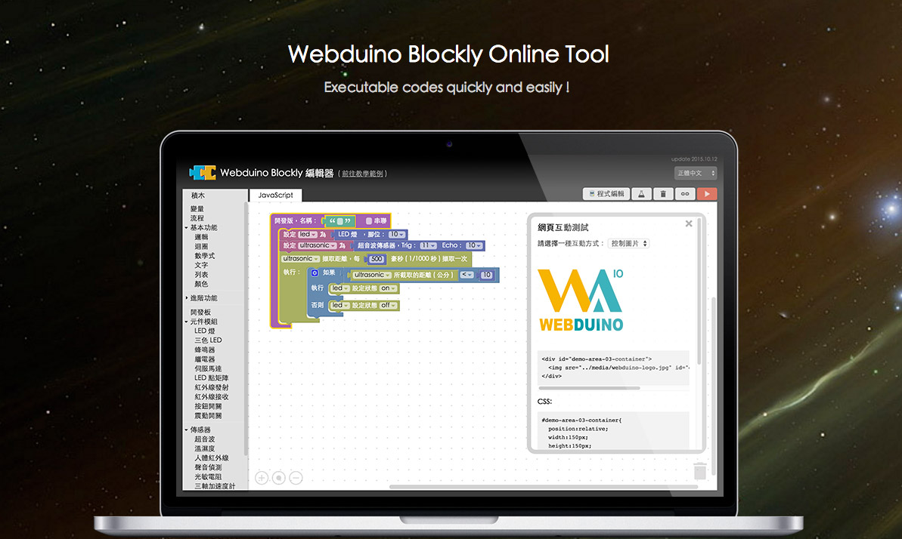
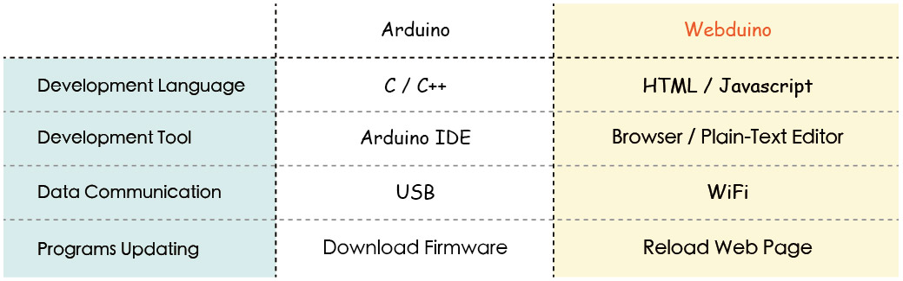

#About Webduino

##Webduino is the easiest way for starting IoT!

In 2015, one team with passion and creation that launched from Kaohsiung city, Taiwan had successfully published a easiest way by the web-based technology for Arduino development, called "Webduino". With Web Components from Webduino, everyone can easily use and control much type of sensors by using pure HTML and JavaScript.  It's really a whole new and powerful development way for the mass developers and web designers.

 

##Webduino Features:

In the future, there will be much manifold type of users in the IoT application domain. Every developers always want to have a comfortable and supporting multi-platform way for developing and learning. So, we created Webduino! It will be the powerful tool and platform for every developer and beginner to explore and develop on the IoT domain.

- **Web-based Development**

	You can control everything as Arduino with pure HTML, JavaScript and other web-based technology,, but more easier.

- **Run on Multi-Platform**

	You can run any project on Windows, Mac, Android, iOS, or any other platform with browser by Webduino.

- **Wireless Control by WiFi**

	With WiFi connection, you can build your own IoT network and create any useful application and service by IoT-based power.

- **Full Education Resources**

	Rich tutorials, sample codes, and videos for education and training course for everyone to be a skilled developer on Webduino.

- **Powerfull Online Tool**

	Webduino Blockly will help developers to generate standard and executable codes quickly and easily.

- **Regular Local Events**

	We have regular local events and training course monthly in order to build a better platform for community from different areas.

 

##Compare Webduino and Arduino developing ways:

Webduino is not a Arduino competitor. The goal of Webduino is providing a whole new develop way to make developing work more easier, improve developing experience, and extend new features for IoT. All of those will help developers or designers without hardcore technology to learn comfortably and quickly, then go deep into and explore IoT domain more confidently.

